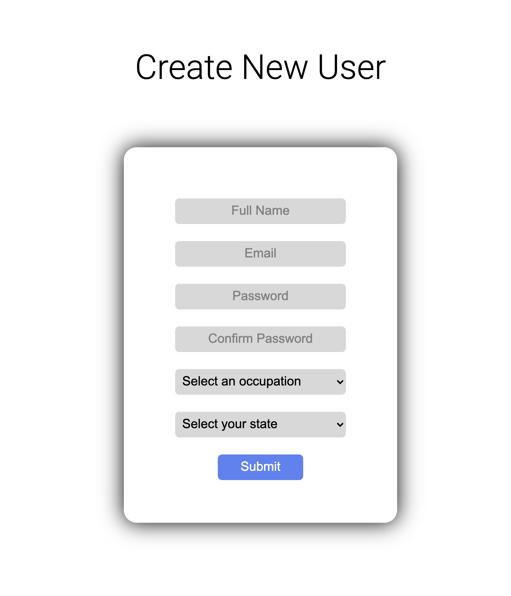
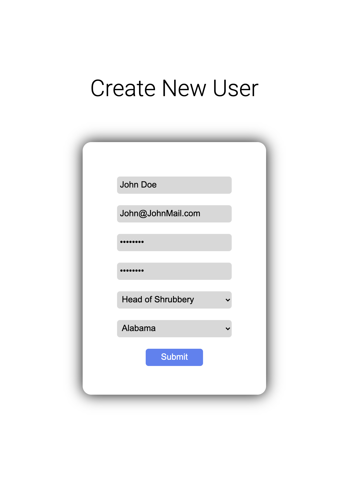
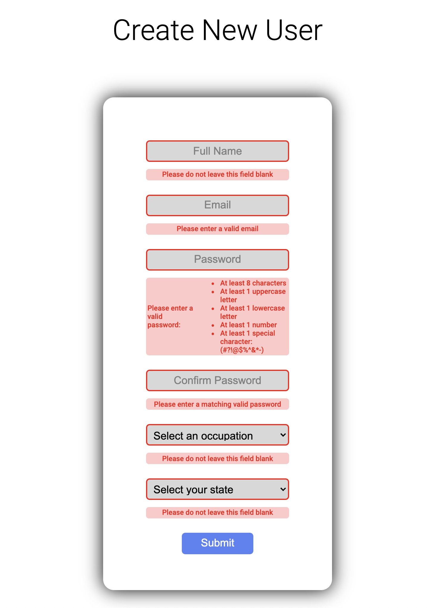
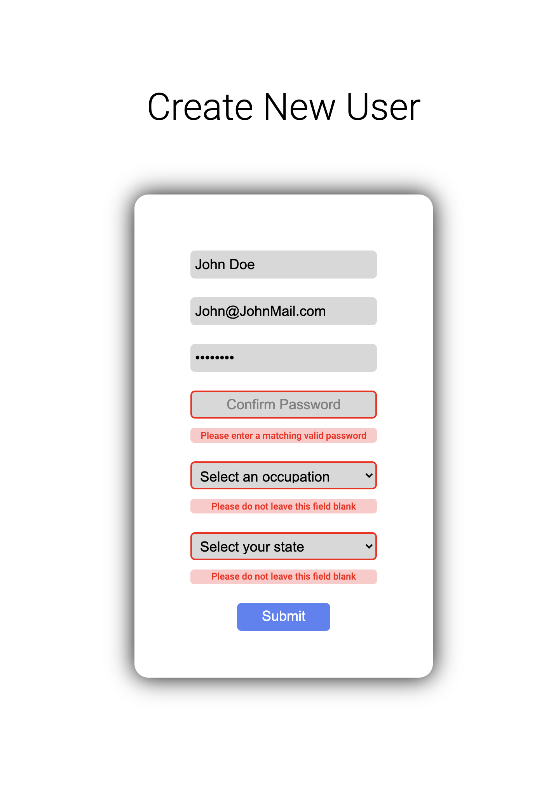

# User Creation Form w/ Validation and Feedback

## This form is live to try out [here!](https://fetch-rewards-exercise.netlify.app/)

## Features:
- Field completeness validation
- Email validation
- Strong password validation
- Password confirmation
- Generating dropdown lists based on options from server
- Success message after form validation, submit, and server response
- Alert flags for user feedback during interaction
- Responsive sizing
- CSS loader while waiting for server

 

## Screenshots:
### Form

 

### Errors

 

### Success
